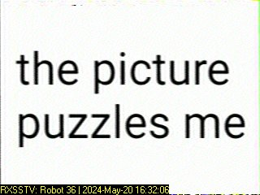
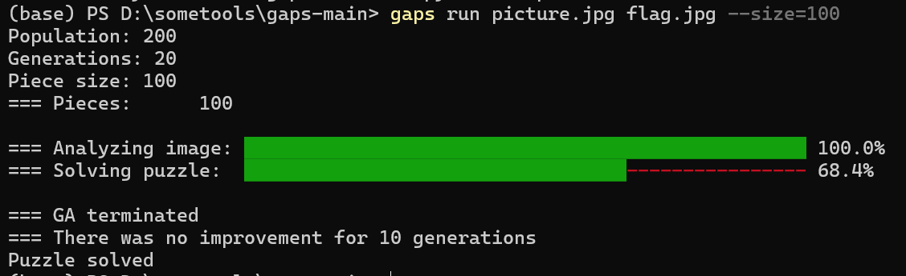
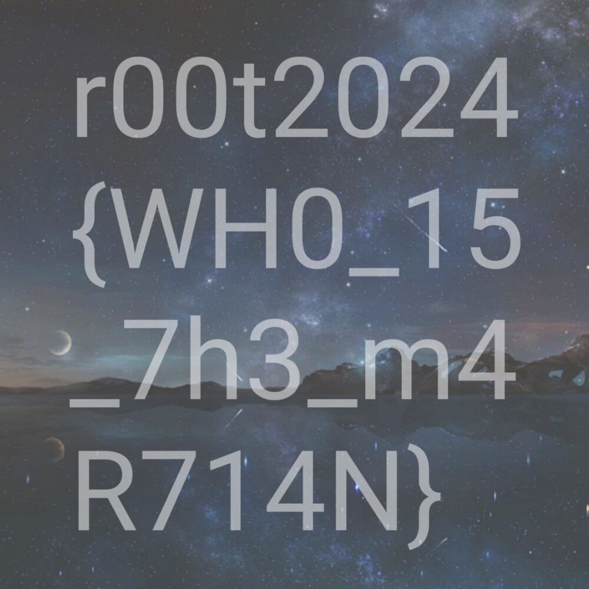

1.附件中的音频可通过SSTV图像解码得到图片

the picture puzzles me`就是附件中压缩包的密码



放两个随便找的SSTV图像解码软件下载地址（也可以另找）：

RX-SSTV：https://www.qsl.net/on6mu/download/Setup_RXSSTV.exe

robot36：https://github.com/xdsopl/robot36

解压后能看到一张拼图


2.调用gaps脚本就能实现自动拼图

安装及使用方法：https://github.com/nemanja-m/gaps

由于整张图分辨率（像素）为1000×1000，所以每一小块为100×100

通过加上size=100或其他条件可缩短拼图所需时间

```
gaps run picture.jpg flag.jpg --size=100
```



得到flag



或者也可以手动拼图

~~真有人会这么做吗~~