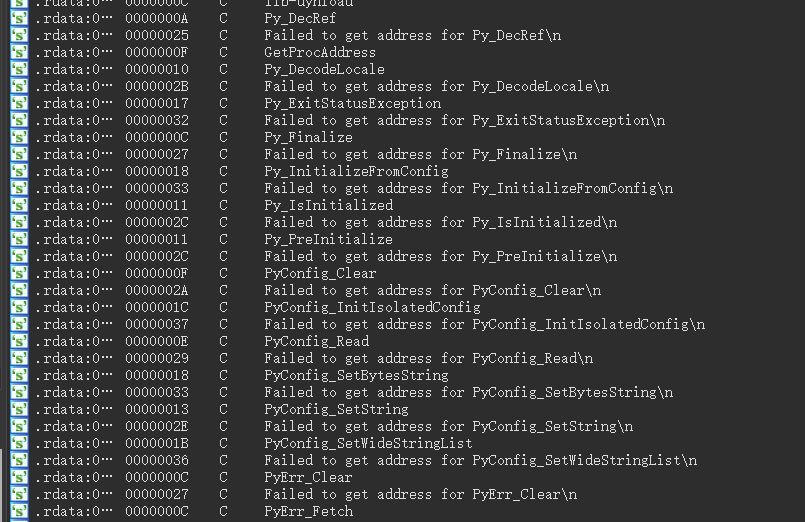

## Zzz3

拖进ida发现分析不动，shift+f12找线索可以看到有很多的python痕迹，这题知识点是py打包成exe



于是使用解包工具https://github.com/extremecoders-re/pyinstxtractor

解包完成后在同级目录下可以找到 `Zzz.exe_extracted`，在里面找到`Zzz.pyc`，该文件就是python文件的字节码文件，而字节码我们不好分析，需要反编译为python语言来分析，这时候可以使用在线网站或者`pycdc`，`uncompyle6`等工具来反编译。（但是uncomply6只支持到py3.8）

使用pycdc可以反编译得到

```python
print('Maybe z3 can help you solve this challenge.')
print('Now give me your flag, and I will check for you.')
flag = input('Input your flag:')
if len(flag) == 22 and ord(flag[0]) * 7072 + ord(flag[1]) * 2523 + ord(flag[2]) * 6714 + ord(flag[3]) * 8810 + ord(flag[4]) * 6796 + ord(flag[5]) * 2647 + ord(flag[6]) * 1347 + ord(flag[7]) * 1289 + ord(flag[8]) * 8917 + ord(flag[9]) * 2304 + ord(flag[10]) * 5001 + ord(flag[11]) * 2882 + ord(flag[12]) * 7232 + ord(flag[13]) * 3192 + ord(flag[14]) * 9676 + ord(flag[15]) * 5436 + ord(flag[16]) * 4407 + ord(flag[17]) * 6269 + ord(flag[18]) * 9623 + ord(flag[19]) * 6230 + ord(flag[20]) * 6292 + ord(flag[21]) * 57 == 10663483 and ord(flag[0]) * 3492 + ord(flag[1]) * 1613 + ord(flag[2]) * 3234 + ord(flag[3]) * 5656 + ord(flag[4]) * 9182 + ord(flag[5]) * 4240 + ord(flag[6]) * 8808 + ord(flag[7]) * 9484 + ord(flag[8]) * 4000 + ord(flag[9]) * 1475 + ord(flag[10]) * 2616 + ord(flag[11]) * 2766 + ord(flag[12]) * 6822 + ord(flag[13]) * 1068 + ord(flag[14]) * 9768 + ord(flag[15]) * 1420 + ord(flag[16]) * 4528 + ord(flag[17]) * 1031 + ord(flag[18]) * 8388 + ord(flag[19]) * 2029 + ord(flag[20]) * 2463 + ord(flag[21]) * 32 == 8010838 and ord(flag[0]) * 9661 + ord(flag[1]) * 1108 + ord(flag[2]) * 2229 + ord(flag[3]) * 1256 + ord(flag[4]) * 7747 + ord(flag[5]) * 5775 + ord(flag[6]) * 5211 + ord(flag[7]) * 2387 + ord(flag[8]) * 1997 + ord(flag[9]) * 4045 + ord(flag[10]) * 7102 + ord(flag[11]) * 7853 + ord(flag[12]) * 5596 + ord(flag[13]) * 6952 + ord(flag[14]) * 8883 + ord(flag[15]) * 5125 + ord(flag[16]) * 9572 + ord(flag[17]) * 1149 + ord(flag[18]) * 7583 + ord(flag[19]) * 1075 + ord(flag[20]) * 9804 + ord(flag[21]) * 72 == 10280844 and ord(flag[0]) * 4314 + ord(flag[1]) * 3509 + ord(flag[2]) * 6200 + ord(flag[3]) * 5546 + ord(flag[4]) * 1705 + ord(flag[5]) * 9518 + ord(flag[6]) * 2975 + ord(flag[7]) * 2689 + ord(flag[8]) * 2412 + ord(flag[9]) * 8659 + ord(flag[10]) * 5459 + ord(flag[11]) * 7572 + ord(flag[12]) * 3042 + ord(flag[13]) * 9701 + ord(flag[14]) * 4697 + ord(flag[15]) * 9863 + ord(flag[16]) * 1296 + ord(flag[17]) * 1278 + ord(flag[18]) * 5721 + ord(flag[19]) * 5116 + ord(flag[20]) * 4147 + ord(flag[21]) * 52 == 9584467 and ord(flag[0]) * 2310 + ord(flag[1]) * 1379 + ord(flag[2]) * 5900 + ord(flag[3]) * 4876 + ord(flag[4]) * 5329 + ord(flag[5]) * 6485 + ord(flag[6]) * 6610 + ord(flag[7]) * 7179 + ord(flag[8]) * 7897 + ord(flag[9]) * 1094 + ord(flag[10]) * 4825 + ord(flag[11]) * 8101 + ord(flag[12]) * 9519 + ord(flag[13]) * 3048 + ord(flag[14]) * 3168 + ord(flag[15]) * 2775 + ord(flag[16]) * 4366 + ord(flag[17]) * 4066 + ord(flag[18]) * 7490 + ord(flag[19]) * 5533 + ord(flag[20]) * 2139 + ord(flag[21]) * 87 == 9117178 and ord(flag[0]) * 1549 + ord(flag[1]) * 8554 + ord(flag[2]) * 6510 + ord(flag[3]) * 6559 + ord(flag[4]) * 5570 + ord(flag[5]) * 1003 + ord(flag[6]) * 8562 + ord(flag[7]) * 6793 + ord(flag[8]) * 3509 + ord(flag[9]) * 4965 + ord(flag[10]) * 6111 + ord(flag[11]) * 1229 + ord(flag[12]) * 5654 + ord(flag[13]) * 2204 + ord(flag[14]) * 2217 + ord(flag[15]) * 5039 + ord(flag[16]) * 5657 + ord(flag[17]) * 9426 + ord(flag[18]) * 7604 + ord(flag[19]) * 5883 + ord(flag[20]) * 5285 + ord(flag[21]) * 17 == 9172029 and ord(flag[0]) * 2678 + ord(flag[1]) * 4369 + ord(flag[2]) * 7509 + ord(flag[3]) * 1564 + ord(flag[4]) * 7777 + ord(flag[5]) * 2271 + ord(flag[6]) * 9696 + ord(flag[7]) * 3874 + ord(flag[8]) * 2212 + ord(flag[9]) * 6764 + ord(flag[10]) * 5727 + ord(flag[11]) * 5971 + ord(flag[12]) * 5876 + ord(flag[13]) * 9959 + ord(flag[14]) * 4604 + ord(flag[15]) * 8461 + ord(flag[16]) * 2350 + ord(flag[17]) * 3564 + ord(flag[18]) * 1831 + ord(flag[19]) * 6088 + ord(flag[20]) * 4575 + ord(flag[21]) * 9 == 9039434 and ord(flag[0]) * 8916 + ord(flag[1]) * 8647 + ord(flag[2]) * 4522 + ord(flag[3]) * 3579 + ord(flag[4]) * 5319 + ord(flag[5]) * 9124 + ord(flag[6]) * 9535 + ord(flag[7]) * 5125 + ord(flag[8]) * 3235 + ord(flag[9]) * 3246 + ord(flag[10]) * 3378 + ord(flag[11]) * 9221 + ord(flag[12]) * 1875 + ord(flag[13]) * 1008 + ord(flag[14]) * 6262 + ord(flag[15]) * 1524 + ord(flag[16]) * 8851 + ord(flag[17]) * 4367 + ord(flag[18]) * 7628 + ord(flag[19]) * 9404 + ord(flag[20]) * 2065 + ord(flag[21]) * 9 == 9846927 and ord(flag[0]) * 9781 + ord(flag[1]) * 9174 + ord(flag[2]) * 3771 + ord(flag[3]) * 6972 + ord(flag[4]) * 6425 + ord(flag[5]) * 7631 + ord(flag[6]) * 8864 + ord(flag[7]) * 9117 + ord(flag[8]) * 4328 + ord(flag[9]) * 3919 + ord(flag[10]) * 6517 + ord(flag[11]) * 7165 + ord(flag[12]) * 6895 + ord(flag[13]) * 3609 + ord(flag[14]) * 3878 + ord(flag[15]) * 1593 + ord(flag[16]) * 9098 + ord(flag[17]) * 6432 + ord(flag[18]) * 2584 + ord(flag[19]) * 8403 + ord(flag[20]) * 4029 + ord(flag[21]) * 30 == 10937004 and ord(flag[0]) * 2511 + ord(flag[1]) * 8583 + ord(flag[2]) * 2428 + ord(flag[3]) * 9439 + ord(flag[4]) * 3662 + ord(flag[5]) * 3278 + ord(flag[6]) * 8305 + ord(flag[7]) * 1100 + ord(flag[8]) * 7972 + ord(flag[9]) * 8510 + ord(flag[10]) * 8552 + ord(flag[11]) * 9993 + ord(flag[12]) * 6855 + ord(flag[13]) * 1702 + ord(flag[14]) * 1640 + ord(flag[15]) * 3787 + ord(flag[16]) * 8161 + ord(flag[17]) * 2110 + ord(flag[18]) * 5320 + ord(flag[19]) * 3313 + ord(flag[20]) * 9286 + ord(flag[21]) * 74 == 10590715 and ord(flag[0]) * 4974 + ord(flag[1]) * 4445 + ord(flag[2]) * 7368 + ord(flag[3]) * 9132 + ord(flag[4]) * 5894 + ord(flag[5]) * 7822 + ord(flag[6]) * 7923 + ord(flag[7]) * 6822 + ord(flag[8]) * 2698 + ord(flag[9]) * 3643 + ord(flag[10]) * 8392 + ord(flag[11]) * 4126 + ord(flag[12]) * 1941 + ord(flag[13]) * 6641 + ord(flag[14]) * 2949 + ord(flag[15]) * 7405 + ord(flag[16]) * 9980 + ord(flag[17]) * 6349 + ord(flag[18]) * 3328 + ord(flag[19]) * 8766 + ord(flag[20]) * 9508 + ord(flag[21]) * 65 == 10808406 and ord(flag[0]) * 4127 + ord(flag[1]) * 4703 + ord(flag[2]) * 6409 + ord(flag[3]) * 4907 + ord(flag[4]) * 5230 + ord(flag[5]) * 3371 + ord(flag[6]) * 5666 + ord(flag[7]) * 3194 + ord(flag[8]) * 5448 + ord(flag[9]) * 8415 + ord(flag[10]) * 4525 + ord(flag[11]) * 4152 + ord(flag[12]) * 1467 + ord(flag[13]) * 5254 + ord(flag[14]) * 2256 + ord(flag[15]) * 1643 + ord(flag[16]) * 9113 + ord(flag[17]) * 8805 + ord(flag[18]) * 4315 + ord(flag[19]) * 8371 + ord(flag[20]) * 1919 + ord(flag[21]) * 2 == 9192066 and ord(flag[0]) * 6245 + ord(flag[1]) * 8783 + ord(flag[2]) * 6059 + ord(flag[3]) * 9375 + ord(flag[4]) * 9253 + ord(flag[5]) * 1974 + ord(flag[6]) * 8867 + ord(flag[7]) * 6423 + ord(flag[8]) * 2577 + ord(flag[9]) * 6613 + ord(flag[10]) * 2040 + ord(flag[11]) * 2209 + ord(flag[12]) * 4147 + ord(flag[13]) * 7151 + ord(flag[14]) * 1011 + ord(flag[15]) * 9446 + ord(flag[16]) * 4362 + ord(flag[17]) * 3073 + ord(flag[18]) * 3006 + ord(flag[19]) * 5499 + ord(flag[20]) * 8850 + ord(flag[21]) * 23 == 9520588 and ord(flag[0]) * 1907 + ord(flag[1]) * 9038 + ord(flag[2]) * 3932 + ord(flag[3]) * 7054 + ord(flag[4]) * 1135 + ord(flag[5]) * 5095 + ord(flag[6]) * 6962 + ord(flag[7]) * 6481 + ord(flag[8]) * 7049 + ord(flag[9]) * 5995 + ord(flag[10]) * 6233 + ord(flag[11]) * 1321 + ord(flag[12]) * 4455 + ord(flag[13]) * 8181 + ord(flag[14]) * 5757 + ord(flag[15]) * 6953 + ord(flag[16]) * 3167 + ord(flag[17]) * 5508 + ord(flag[18]) * 4602 + ord(flag[19]) * 1420 + ord(flag[20]) * 3075 + ord(flag[21]) * 25 == 9425728 and ord(flag[0]) * 1489 + ord(flag[1]) * 9236 + ord(flag[2]) * 7398 + ord(flag[3]) * 4088 + ord(flag[4]) * 4131 + ord(flag[5]) * 1657 + ord(flag[6]) * 9068 + ord(flag[7]) * 6420 + ord(flag[8]) * 3970 + ord(flag[9]) * 3265 + ord(flag[10]) * 5343 + ord(flag[11]) * 5386 + ord(flag[12]) * 2583 + ord(flag[13]) * 2813 + ord(flag[14]) * 7181 + ord(flag[15]) * 9116 + ord(flag[16]) * 4836 + ord(flag[17]) * 6917 + ord(flag[18]) * 1123 + ord(flag[19]) * 7276 + ord(flag[20]) * 2257 + ord(flag[21]) * 65 == 8793771 and ord(flag[0]) * 2097 + ord(flag[1]) * 1253 + ord(flag[2]) * 1469 + ord(flag[3]) * 2731 + ord(flag[4]) * 9565 + ord(flag[5]) * 9185 + ord(flag[6]) * 1095 + ord(flag[7]) * 8666 + ord(flag[8]) * 2919 + ord(flag[9]) * 7962 + ord(flag[10]) * 1497 + ord(flag[11]) * 6642 + ord(flag[12]) * 4108 + ord(flag[13]) * 6892 + ord(flag[14]) * 7161 + ord(flag[15]) * 7552 + ord(flag[16]) * 5666 + ord(flag[17]) * 4060 + ord(flag[18]) * 7799 + ord(flag[19]) * 5080 + ord(flag[20]) * 8516 + ord(flag[21]) * 43 == 9687343 and ord(flag[0]) * 1461 + ord(flag[1]) * 1676 + ord(flag[2]) * 4755 + ord(flag[3]) * 7982 + ord(flag[4]) * 3860 + ord(flag[5]) * 1067 + ord(flag[6]) * 6715 + ord(flag[7]) * 4019 + ord(flag[8]) * 4983 + ord(flag[9]) * 2031 + ord(flag[10]) * 1173 + ord(flag[11]) * 2241 + ord(flag[12]) * 2594 + ord(flag[13]) * 8672 + ord(flag[14]) * 4810 + ord(flag[15]) * 7963 + ord(flag[16]) * 7749 + ord(flag[17]) * 5730 + ord(flag[18]) * 9855 + ord(flag[19]) * 5858 + ord(flag[20]) * 2349 + ord(flag[21]) * 71 == 9082436 and ord(flag[0]) * 9025 + ord(flag[1]) * 9536 + ord(flag[2]) * 1515 + ord(flag[3]) * 8177 + ord(flag[4]) * 6109 + ord(flag[5]) * 4856 + ord(flag[6]) * 6692 + ord(flag[7]) * 4929 + ord(flag[8]) * 1010 + ord(flag[9]) * 3995 + ord(flag[10]) * 3511 + ord(flag[11]) * 5910 + ord(flag[12]) * 3501 + ord(flag[13]) * 3731 + ord(flag[14]) * 6601 + ord(flag[15]) * 6200 + ord(flag[16]) * 8177 + ord(flag[17]) * 5488 + ord(flag[18]) * 5957 + ord(flag[19]) * 9661 + ord(flag[20]) * 4956 + ord(flag[21]) * 48 == 10355650 and ord(flag[0]) * 4462 + ord(flag[1]) * 1940 + ord(flag[2]) * 5956 + ord(flag[3]) * 4965 + ord(flag[4]) * 9268 + ord(flag[5]) * 9627 + ord(flag[6]) * 3564 + ord(flag[7]) * 5417 + ord(flag[8]) * 2039 + ord(flag[9]) * 7269 + ord(flag[10]) * 9667 + ord(flag[11]) * 4158 + ord(flag[12]) * 2856 + ord(flag[13]) * 2851 + ord(flag[14]) * 9696 + ord(flag[15]) * 5986 + ord(flag[16]) * 6237 + ord(flag[17]) * 5845 + ord(flag[18]) * 5467 + ord(flag[19]) * 5227 + ord(flag[20]) * 4771 + ord(flag[21]) * 72 == 10243720 and ord(flag[0]) * 4618 + ord(flag[1]) * 8621 + ord(flag[2]) * 8144 + ord(flag[3]) * 7115 + ord(flag[4]) * 1577 + ord(flag[5]) * 8602 + ord(flag[6]) * 3886 + ord(flag[7]) * 3712 + ord(flag[8]) * 1258 + ord(flag[9]) * 7063 + ord(flag[10]) * 1872 + ord(flag[11]) * 9855 + ord(flag[12]) * 4167 + ord(flag[13]) * 7615 + ord(flag[14]) * 6298 + ord(flag[15]) * 7682 + ord(flag[16]) * 8795 + ord(flag[17]) * 3856 + ord(flag[18]) * 6217 + ord(flag[19]) * 5764 + ord(flag[20]) * 5076 + ord(flag[21]) * 93 == 10806414 and ord(flag[0]) * 7466 + ord(flag[1]) * 8442 + ord(flag[2]) * 4822 + ord(flag[3]) * 7639 + ord(flag[4]) * 2049 + ord(flag[5]) * 7311 + ord(flag[6]) * 5816 + ord(flag[7]) * 8433 + ord(flag[8]) * 5905 + ord(flag[9]) * 4838 + ord(flag[10]) * 1251 + ord(flag[11]) * 8184 + ord(flag[12]) * 6465 + ord(flag[13]) * 4634 + ord(flag[14]) * 5513 + ord(flag[15]) * 3160 + ord(flag[16]) * 6720 + ord(flag[17]) * 9205 + ord(flag[18]) * 6671 + ord(flag[19]) * 7716 + ord(flag[20]) * 1905 + ord(flag[21]) * 29 == 10979942 and ord(flag[0]) * 5926 + ord(flag[1]) * 9095 + ord(flag[2]) * 2048 + ord(flag[3]) * 4639 + ord(flag[4]) * 3035 + ord(flag[5]) * 9560 + ord(flag[6]) * 1591 + ord(flag[7]) * 2392 + ord(flag[8]) * 1812 + ord(flag[9]) * 6732 + ord(flag[10]) * 9454 + ord(flag[11]) * 8175 + ord(flag[12]) * 7346 + ord(flag[13]) * 6333 + ord(flag[14]) * 9812 + ord(flag[15]) * 2034 + ord(flag[16]) * 6634 + ord(flag[17]) * 1762 + ord(flag[18]) * 7058 + ord(flag[19]) * 3524 + ord(flag[20]) * 7462 + ord(flag[21]) * 11 == 10532285:
    print('Congratulate!!!You are right!')
    return None
None('What a pity...Please try again >__<')
```

阅读代码可以发现是一个21元的方程组。题目提示了使用z3来解方程组，可以自行学习z3的使用方法。 在提取表达式时，VSCode的多光标操作可以帮助提高一些效率。

> 按住alt+shift拖动光标可以在同一列添加多个光标 选中一部分字符，按ctrl+f2可以选中所有相同的字符

解题脚本

```python
from z3 import *

flag = [Int("input[%d]"%i) for i in range(22)]

s = Solver()
s.add(flag[0] * 7072 + flag[1] * 2523 + flag[2] * 6714 + flag[3] * 8810 + flag[4] * 6796 + flag[5] * 2647 + flag[6] * 1347 + flag[7] * 1289 + flag[8] * 8917 + flag[9] * 2304 + flag[10] * 5001 + flag[11] * 2882 + flag[12] * 7232 + flag[13] * 3192 + flag[14] * 9676 + flag[15] * 5436 + flag[16] * 4407 + flag[17] * 6269 + flag[18] * 9623 + flag[19] * 6230 + flag[20] * 6292 + flag[21] * 57 == 10663483 )
s.add(flag[0] * 3492 + flag[1] * 1613 + flag[2] * 3234 + flag[3] * 5656 + flag[4] * 9182 + flag[5] * 4240 + flag[6] * 8808 + flag[7] * 9484 + flag[8] * 4000 + flag[9] * 1475 + flag[10] * 2616 + flag[11] * 2766 + flag[12] * 6822 + flag[13] * 1068 + flag[14] * 9768 + flag[15] * 1420 + flag[16] * 4528 + flag[17] * 1031 + flag[18] * 8388 + flag[19] * 2029 + flag[20] * 2463 + flag[21] * 32 == 8010838 )
s.add(flag[0] * 9661 + flag[1] * 1108 + flag[2] * 2229 + flag[3] * 1256 + flag[4] * 7747 + flag[5] * 5775 + flag[6] * 5211 + flag[7] * 2387 + flag[8] * 1997 + flag[9] * 4045 + flag[10] * 7102 + flag[11] * 7853 + flag[12] * 5596 + flag[13] * 6952 + flag[14] * 8883 + flag[15] * 5125 + flag[16] * 9572 + flag[17] * 1149 + flag[18] * 7583 + flag[19] * 1075 + flag[20] * 9804 + flag[21] * 72 == 10280844 )
s.add(flag[0] * 4314 + flag[1] * 3509 + flag[2] * 6200 + flag[3] * 5546 + flag[4] * 1705 + flag[5] * 9518 + flag[6] * 2975 + flag[7] * 2689 + flag[8] * 2412 + flag[9] * 8659 + flag[10] * 5459 + flag[11] * 7572 + flag[12] * 3042 + flag[13] * 9701 + flag[14] * 4697 + flag[15] * 9863 + flag[16] * 1296 + flag[17] * 1278 + flag[18] * 5721 + flag[19] * 5116 + flag[20] * 4147 + flag[21] * 52 == 9584467 )
s.add(flag[0] * 2310 + flag[1] * 1379 + flag[2] * 5900 + flag[3] * 4876 + flag[4] * 5329 + flag[5] * 6485 + flag[6] * 6610 + flag[7] * 7179 + flag[8] * 7897 + flag[9] * 1094 + flag[10] * 4825 + flag[11] * 8101 + flag[12] * 9519 + flag[13] * 3048 + flag[14] * 3168 + flag[15] * 2775 + flag[16] * 4366 + flag[17] * 4066 + flag[18] * 7490 + flag[19] * 5533 + flag[20] * 2139 + flag[21] * 87 == 9117178)
s.add(flag[0] * 1549 + flag[1] * 8554 + flag[2] * 6510 + flag[3] * 6559 + flag[4] * 5570 + flag[5] * 1003 + flag[6] * 8562 + flag[7] * 6793 + flag[8] * 3509 + flag[9] * 4965 + flag[10] * 6111 + flag[11] * 1229 + flag[12] * 5654 + flag[13] * 2204 + flag[14] * 2217 + flag[15] * 5039 + flag[16] * 5657 + flag[17] * 9426 + flag[18] * 7604 + flag[19] * 5883 + flag[20] * 5285 + flag[21] * 17 == 9172029 )
s.add(flag[0] * 2678 + flag[1] * 4369 + flag[2] * 7509 + flag[3] * 1564 + flag[4] * 7777 + flag[5] * 2271 + flag[6] * 9696 + flag[7] * 3874 + flag[8] * 2212 + flag[9] * 6764 + flag[10] * 5727 + flag[11] * 5971 + flag[12] * 5876 + flag[13] * 9959 + flag[14] * 4604 + flag[15] * 8461 + flag[16] * 2350 + flag[17] * 3564 + flag[18] * 1831 + flag[19] * 6088 + flag[20] * 4575 + flag[21] * 9 == 9039434 )
s.add(flag[0] * 8916 + flag[1] * 8647 + flag[2] * 4522 + flag[3] * 3579 + flag[4] * 5319 + flag[5] * 9124 + flag[6] * 9535 + flag[7] * 5125 + flag[8] * 3235 + flag[9] * 3246 + flag[10] * 3378 + flag[11] * 9221 + flag[12] * 1875 + flag[13] * 1008 + flag[14] * 6262 + flag[15] * 1524 + flag[16] * 8851 + flag[17] * 4367 + flag[18] * 7628 + flag[19] * 9404 + flag[20] * 2065 + flag[21] * 9 == 9846927)
s.add(flag[0] * 9781 + flag[1] * 9174 + flag[2] * 3771 + flag[3] * 6972 + flag[4] * 6425 + flag[5] * 7631 + flag[6] * 8864 + flag[7] * 9117 + flag[8] * 4328 + flag[9] * 3919 + flag[10] * 6517 + flag[11] * 7165 + flag[12] * 6895 + flag[13] * 3609 + flag[14] * 3878 + flag[15] * 1593 + flag[16] * 9098 + flag[17] * 6432 + flag[18] * 2584 + flag[19] * 8403 + flag[20] * 4029 + flag[21] * 30 == 10937004 )
s.add(flag[0] * 2511 + flag[1] * 8583 + flag[2] * 2428 + flag[3] * 9439 + flag[4] * 3662 + flag[5] * 3278 + flag[6] * 8305 + flag[7] * 1100 + flag[8] * 7972 + flag[9] * 8510 + flag[10] * 8552 + flag[11] * 9993 + flag[12] * 6855 + flag[13] * 1702 + flag[14] * 1640 + flag[15] * 3787 + flag[16] * 8161 + flag[17] * 2110 + flag[18] * 5320 + flag[19] * 3313 + flag[20] * 9286 + flag[21] * 74 == 10590715)
s.add(flag[0] * 4974 + flag[1] * 4445 + flag[2] * 7368 + flag[3] * 9132 + flag[4] * 5894 + flag[5] * 7822 + flag[6] * 7923 + flag[7] * 6822 + flag[8] * 2698 + flag[9] * 3643 + flag[10] * 8392 + flag[11] * 4126 + flag[12] * 1941 + flag[13] * 6641 + flag[14] * 2949 + flag[15] * 7405 + flag[16] * 9980 + flag[17] * 6349 + flag[18] * 3328 + flag[19] * 8766 + flag[20] * 9508 + flag[21] * 65 == 10808406 )
s.add(flag[0] * 4127 + flag[1] * 4703 + flag[2] * 6409 + flag[3] * 4907 + flag[4] * 5230 + flag[5] * 3371 + flag[6] * 5666 + flag[7] * 3194 + flag[8] * 5448 + flag[9] * 8415 + flag[10] * 4525 + flag[11] * 4152 + flag[12] * 1467 + flag[13] * 5254 + flag[14] * 2256 + flag[15] * 1643 + flag[16] * 9113 + flag[17] * 8805 + flag[18] * 4315 + flag[19] * 8371 + flag[20] * 1919 + flag[21] * 2 == 9192066 )
s.add(flag[0] * 6245 + flag[1] * 8783 + flag[2] * 6059 + flag[3] * 9375 + flag[4] * 9253 + flag[5] * 1974 + flag[6] * 8867 + flag[7] * 6423 + flag[8] * 2577 + flag[9] * 6613 + flag[10] * 2040 + flag[11] * 2209 + flag[12] * 4147 + flag[13] * 7151 + flag[14] * 1011 + flag[15] * 9446 + flag[16] * 4362 + flag[17] * 3073 + flag[18] * 3006 + flag[19] * 5499 + flag[20] * 8850 + flag[21] * 23 == 9520588)
s.add(flag[0] * 1907 + flag[1] * 9038 + flag[2] * 3932 + flag[3] * 7054 + flag[4] * 1135 + flag[5] * 5095 + flag[6] * 6962 + flag[7] * 6481 + flag[8] * 7049 + flag[9] * 5995 + flag[10] * 6233 + flag[11] * 1321 + flag[12] * 4455 + flag[13] * 8181 + flag[14] * 5757 + flag[15] * 6953 + flag[16] * 3167 + flag[17] * 5508 + flag[18] * 4602 + flag[19] * 1420 + flag[20] * 3075 + flag[21] * 25 == 9425728)
s.add(flag[0] * 1489 + flag[1] * 9236 + flag[2] * 7398 + flag[3] * 4088 + flag[4] * 4131 + flag[5] * 1657 + flag[6] * 9068 + flag[7] * 6420 + flag[8] * 3970 + flag[9] * 3265 + flag[10] * 5343 + flag[11] * 5386 + flag[12] * 2583 + flag[13] * 2813 + flag[14] * 7181 + flag[15] * 9116 + flag[16] * 4836 + flag[17] * 6917 + flag[18] * 1123 + flag[19] * 7276 + flag[20] * 2257 + flag[21] * 65 == 8793771 )
s.add(flag[0] * 2097 + flag[1] * 1253 + flag[2] * 1469 + flag[3] * 2731 + flag[4] * 9565 + flag[5] * 9185 + flag[6] * 1095 + flag[7] * 8666 + flag[8] * 2919 + flag[9] * 7962 + flag[10] * 1497 + flag[11] * 6642 + flag[12] * 4108 + flag[13] * 6892 + flag[14] * 7161 + flag[15] * 7552 + flag[16] * 5666 + flag[17] * 4060 + flag[18] * 7799 + flag[19] * 5080 + flag[20] * 8516 + flag[21] * 43 == 9687343)
s.add(flag[0] * 1461 + flag[1] * 1676 + flag[2] * 4755 + flag[3] * 7982 + flag[4] * 3860 + flag[5] * 1067 + flag[6] * 6715 + flag[7] * 4019 + flag[8] * 4983 + flag[9] * 2031 + flag[10] * 1173 + flag[11] * 2241 + flag[12] * 2594 + flag[13] * 8672 + flag[14] * 4810 + flag[15] * 7963 + flag[16] * 7749 + flag[17] * 5730 + flag[18] * 9855 + flag[19] * 5858 + flag[20] * 2349 + flag[21] * 71 == 9082436 )
s.add(flag[0] * 9025 + flag[1] * 9536 + flag[2] * 1515 + flag[3] * 8177 + flag[4] * 6109 + flag[5] * 4856 + flag[6] * 6692 + flag[7] * 4929 + flag[8] * 1010 + flag[9] * 3995 + flag[10] * 3511 + flag[11] * 5910 + flag[12] * 3501 + flag[13] * 3731 + flag[14] * 6601 + flag[15] * 6200 + flag[16] * 8177 + flag[17] * 5488 + flag[18] * 5957 + flag[19] * 9661 + flag[20] * 4956 + flag[21] * 48 == 10355650 )
s.add(flag[0] * 4462 + flag[1] * 1940 + flag[2] * 5956 + flag[3] * 4965 + flag[4] * 9268 + flag[5] * 9627 + flag[6] * 3564 + flag[7] * 5417 + flag[8] * 2039 + flag[9] * 7269 + flag[10] * 9667 + flag[11] * 4158 + flag[12] * 2856 + flag[13] * 2851 + flag[14] * 9696 + flag[15] * 5986 + flag[16] * 6237 + flag[17] * 5845 + flag[18] * 5467 + flag[19] * 5227 + flag[20] * 4771 + flag[21] * 72 == 10243720 )
s.add(flag[0] * 4618 + flag[1] * 8621 + flag[2] * 8144 + flag[3] * 7115 + flag[4] * 1577 + flag[5] * 8602 + flag[6] * 3886 + flag[7] * 3712 + flag[8] * 1258 + flag[9] * 7063 + flag[10] * 1872 + flag[11] * 9855 + flag[12] * 4167 + flag[13] * 7615 + flag[14] * 6298 + flag[15] * 7682 + flag[16] * 8795 + flag[17] * 3856 + flag[18] * 6217 + flag[19] * 5764 + flag[20] * 5076 + flag[21] * 93 == 10806414)
s.add(flag[0] * 7466 + flag[1] * 8442 + flag[2] * 4822 + flag[3] * 7639 + flag[4] * 2049 + flag[5] * 7311 + flag[6] * 5816 + flag[7] * 8433 + flag[8] * 5905 + flag[9] * 4838 + flag[10] * 1251 + flag[11] * 8184 + flag[12] * 6465 + flag[13] * 4634 + flag[14] * 5513 + flag[15] * 3160 + flag[16] * 6720 + flag[17] * 9205 + flag[18] * 6671 + flag[19] * 7716 + flag[20] * 1905 + flag[21] * 29 ==  10979942 )
s.add(flag[0] * 5926 + flag[1] * 9095 + flag[2] * 2048 + flag[3] * 4639 + flag[4] * 3035 + flag[5] * 9560 + flag[6] * 1591 + flag[7] * 2392 + flag[8] * 1812 + flag[9] * 6732 + flag[10] * 9454 + flag[11] * 8175 + flag[12] * 7346 + flag[13] * 6333 + flag[14] * 9812 + flag[15] * 2034 + flag[16] * 6634 + flag[17] * 1762 + flag[18] * 7058 + flag[19] * 3524 + flag[20] * 7462 + flag[21] * 11 == 10532285)
if s.check() == sat:
    m = s.model()
    for i in range(22):
        print(chr(int(str(m[flag[i]]))),end = '')
```

