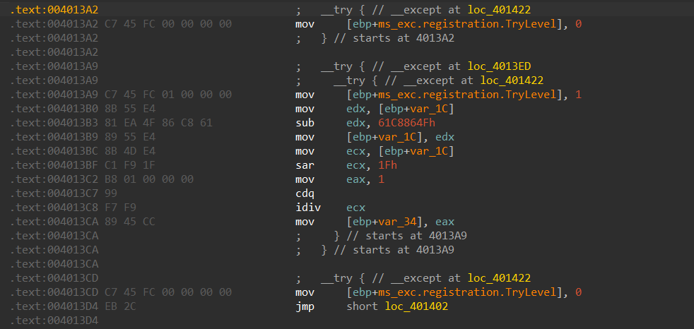
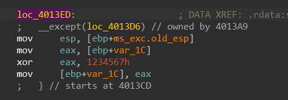
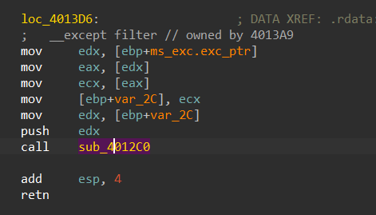
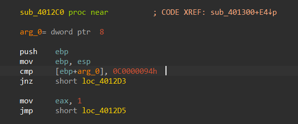

## unwind

知识点：seh+xtea（感觉seh可以让新生适应一下伪代码和汇编一起看）

打开ida，来到main，按住f5看伪代码，`sub_401300`显然是加密，下面的for循环是校验。

`sub_401300`就是xtea加密，关于tea可以自行搜索

正常按部就班用xtea的解密方式解密出来是一堆乱码，怀疑有可能是这个函数隐藏了一些代码逻辑，翻一下函数的汇编，可以发现：



关于seh，可以参考[深入解析结构化异常处理(SEH)_win32 结构化异常处理(seh)探秘-CSDN博客](https://blog.csdn.net/aa13058219642/article/details/80253609)或自己搜索。

这里有两个try块，分别属于`loc_4013ED`和`loc_401422`，我们先看外层：



这里的代码即`__except`块中处理异常的代码，这段代码的作用是每次对xtea加密中的sum值异或`0x1234567`。

进入`loc_4013D6`，查看过滤器



进入`sub_4012c0`



这里选中0c0000094h，按下m，ida会枚举常量搜索到异常值，也就是`EXCEPTION_INT_DIVIDE_BY_ZERO`除零异常

内层也是同样的分析方法，`EXCEPTION_INT_OVERFLOW`导致将0x9E3779B1赋给sum

解题函数如下：

```c
void decipher(unsigned int num_rounds, uint32_t v[2], uint32_t const key[4]) {
    unsigned int i;
    uint32_t v0 = v[0], v1 = v[1], sum = 0xc78e4d05;
    for (i = 0; i < num_rounds; i++) {
        v1 -= (((v0 << 4) ^ (v0 >> 5)) + v0) ^ (sum + key[(sum >> 11) & 3]);
        if (sum >> 31 == 0)
            sum ^= 0x1234567;
        sum -= delta;
        printf("%x\n", sum);
        v0 -= (((v1 << 4) ^ (v1 >> 5)) + v1) ^ (sum + key[sum & 3]);
    }
    v[0] = v0; v[1] = v1;
}
```

