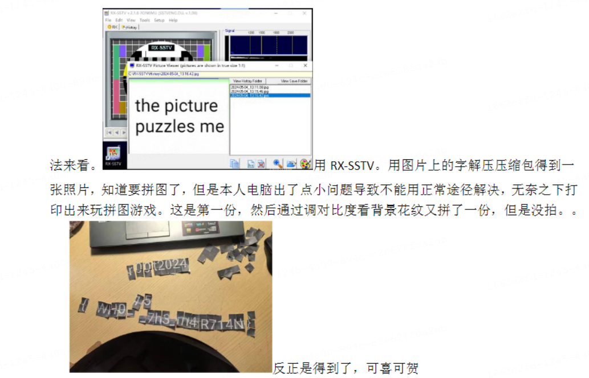
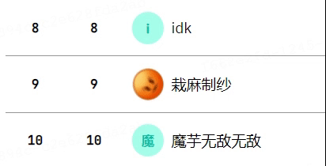
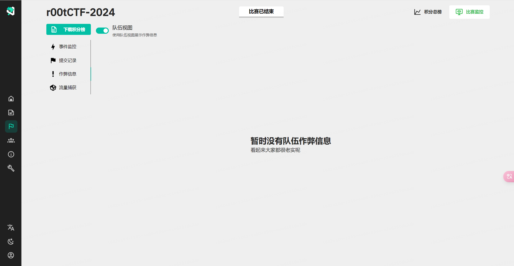
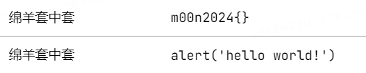
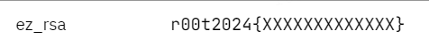
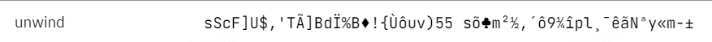
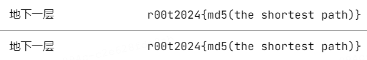
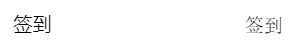
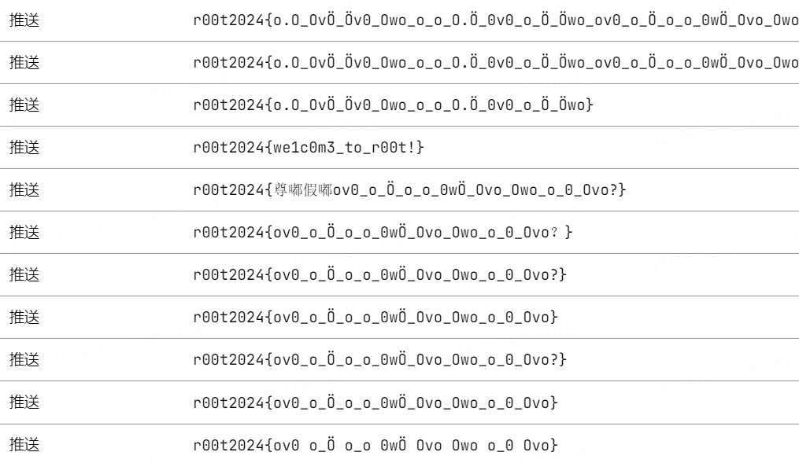

# 花絮

每次新生赛都应该有一些有趣的事嘛！

---

ghostflyby 师傅的 MC 游戏题不幸流产，但 r00t 在近期的比赛中赢下了一台三个月的且性能还不错的服务器，并且正在（打算）筹划着搭建一个 MC 服务器一起玩耍，或许可以期待一下？（咕咕咕，r00t 的各位发出了这般肯定的声音）

---

Lethe 师傅（Misc 拼图题的出题人）在「呀嘿！」同学的 WP 中发现这位同学将拼图打印下来手拼，大受震撼的同时被这位同学的精神打动，并决定为其特赠一份拼图奖品（往年手拼的同学可以要求补一份吗？）

---

排行榜前三的两位师傅辛苦打题，竟是为了...

你说得对，但是每次我一打开榜就能看到「裁麻制纱」同学的头在转

---

暂时没有队伍作弊信息，看起来大家都很老实呢

但是各位同学的 flag 提交姿势依旧多样，有试图给 r00t 改名，顺便打 XSS 的（GZCTF 平台的洞就交给你来挖了）：

有提交样例 flag 识图萌混过关的：

有试图用不可见字符说服平台的：

有试图在 flag 提交框调用函数的：

有耿直签到的：

以及一大片被尊嘟语折磨的：

尊嘟假嘟 O.o？

---

期待与各位同学们的线下见面以及明年的新生赛~

—— Festu
