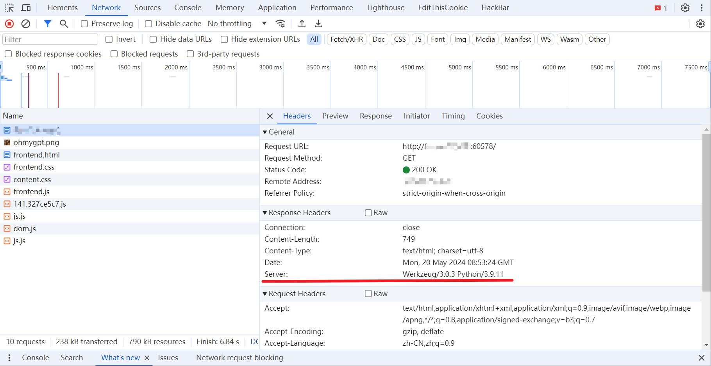

# CheatGPT

好像被有的同学误解成了 SQL 注入/提示词注入，实际上是一个有 WAF 的 SSTI（模板注入）。

观察这位假 GPT 的输出，会将你输入的内容在页面上重复显示一遍，这就有可能是一个模板注入。具体关于什么是模板注入可以自己搜博客学习，简单来说你的输入会被传给一个预先写好的 HTML 文件当中解析，你嵌入模板的渲染语句就可以访问到他的运行时环境（本题是 flask 的 Jinja2 模板上下文，一个语法上类 python 的上下文环境）从而实现「任意命令执行（RCE）」

首先需要解决的问题是知道这是一个什么模板引擎，有很多办法，你可以拿常见的模板渲染格式去测试，比如：`{{"7" * 7}}` ，也可以做一个简单信息搜集，例如很多 Web 服务会在 HTTP 响应头中写上服务器的一些 banner 信息：



F12 打开开发者工具，进入 Network 模块，刷新页面后该模块会记录所有的流量信息，在访问题目页面的响应头中能看到关键字是 Werkzeug+Python，那大概率是 flask+Jinja2，搜索相关 SSTI 的博客学习如何注入即可。

本题设置了一个 WAF，对所有请求参数和 POST 传入的 query 分别做了过滤：

```python
def waf_query(q):
    nop = [
        "\"", 
        "\'", 
        "+", 
        "join"   
           ]
    for elm in nop:
        if elm in q:
            return elm
    return None

def waf_args():
    nop = [
        "rm", 
        "echo", "<", ">", "export", "printenv", 
        "env",
        "proc", 
        "import"
        ]
    for v in request.args.values():
        for elm in nop:
            if elm in v:
                return elm
            
    for v in request.form.values():
        for elm in nop:
            if elm in v:
                return elm
    return None
```

为了降低难度将触发 WAF 的具体内容打印了出来（黑盒测试的 Web 在缺少 Fuzz 的情况下是很恶心人的），绕的手段也比较多，这里提供一种思路是用 flask 的 `request.args` 从请求参数中拿到字符串，利用"_wrap_close"类实现 RCE：

POST 访问：`http://IP:PORT/?cls=_wrap_close&cmd=set`，传参：

```python
query={{c.__init__.__globals__.popen(request.args.cmd).read()}}
```

往 cmd 里输入命令就能执行，flag 在环境变量里，`env, export` 等被过滤了，还能用 set。也可以通过管道、编码或者反引号等方法绕过关键字的过滤。